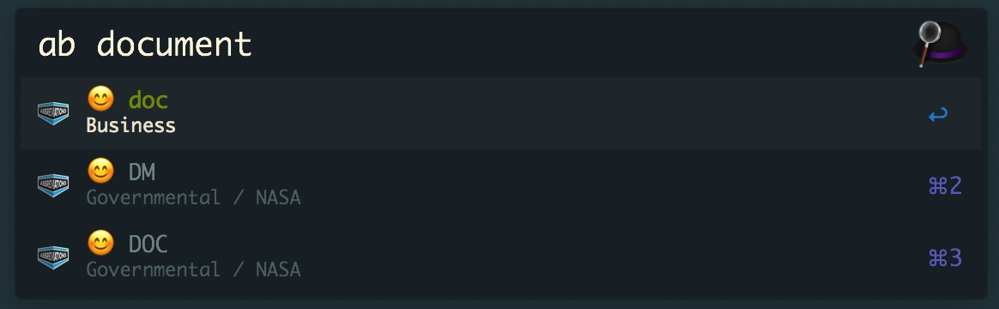

# alfred-abbreviation [](https://travis-ci.org/MinionsDave/alfred-abbreviation)

> Alfred 3 workflow to query word abbreviation from abbreviations.com




## Install

```
$ npm install --global alfred-abbreviation
```

*Requires [Node.js](https://nodejs.org) 8+ and the Alfred [Powerpack](https://www.alfredapp.com/powerpack/).*


## Usage

In Alfred, type `ab`, <kbd>Enter</kbd>, and the word, to find abbreviation.

Select an abbreviation and press <kbd>Enter</kbd> to copy it to the clipboard.


## License

MIT © [MinionsDave](https://github.com/MinionsDave)
